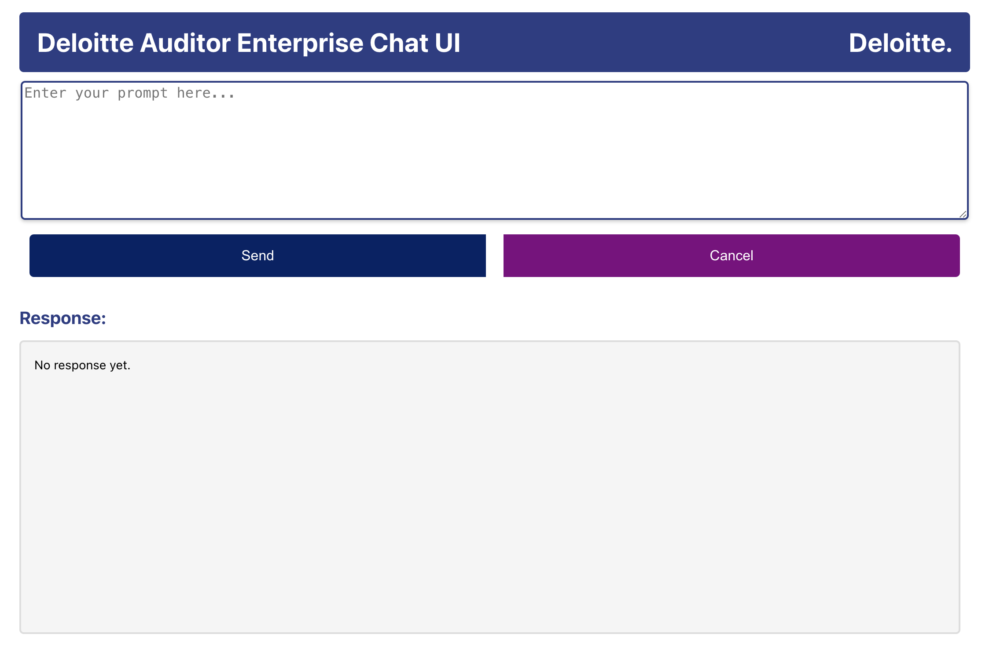

# Deloitte-Auditor-Enterprise-Chat-Application
This project provides a chat-based interface to assist Deloitte auditors in handling tax-related queries. The application uses OpenAI's GPT-3.5 to answer auditor queries based on U.S. tax laws.
The project consists of two main components:
- Frontend: A ReactJS web application for user interaction.
- Backend: A Python Bottle server that interfaces with OpenAI’s API and stores query history in a MySQL database.

## Features

- User Query Interface: Auditors can input their tax-related queries through a web-based chat interface.
- GPT-3.5 Integration: Queries are sent to OpenAI's GPT-3.5, which provides context-aware, precise responses.
- Query History: Conversation history is stored in a MySQL database, allowing the system to maintain context over multiple queries.
- Simple UI: The interface is designed to be intuitive and user-friendly for auditors.

```
.
├── Backend                   # Backend server in Python (Bottle framework)
│   ├── server.py             # Main backend application
├── Frontend                  # Frontend ReactJS application
│   ├── src                   # Source code for React app
│   └── public                # Public assets like index.html
```

## Frontend Interface



## Installation and Setup

Follow these instructions to set up both the backend and frontend of the application.

### Backend Setup (Python + MySQL)

- git clone https://github.com/yourusername/deloitte-chat.git
- cd deloitte-chat/Backend
- python3 -m venv venv
- source venv/bin/activate  # On Windows: venv\Scripts\activate
- pip install -r requirements.txt

#### Set Up the MySQL Database
- mysql -u root
- CREATE DATABASE cmpe;
- USE cmpe;

- CREATE TABLE gpt_history (
    id INT AUTO_INCREMENT PRIMARY KEY,
    role VARCHAR(20),
    message TEXT,
    time DATETIME
);

#### Configure Environment Variables
Create a .env file to store your OpenAI API Key (or export it directly in your shell):
- export OPENAI_API_KEY="your-openai-api-key"

#### Run the Backend Server
python server.py

The server will now be running at http://localhost:8888

### Frontend Setup (ReactJS)

- cd ../Frontend
- npm install
- npm start

The React development server should open at http://localhost:3000 in your web browser.

## How to Use

- Open the Application:
      - Visit http://localhost:3000 in your browser.
 - Enter a Query: Enter your tax-related query into the text box (e.g., "What are the tax implications of selling a rental property?").
 - Send the Query: Click the Send button to submit the query to the GPT-3.5 backend.
 - View the Response: The GPT-3.5 model will respond, and the response will appear below the prompt. Previous responses are stored in the database and included as context in future queries.

   ## API Endpoints
   POST /tax-chat
   

## Acknowledgments

OpenAI for providing the GPT-3.5-turbo model.


